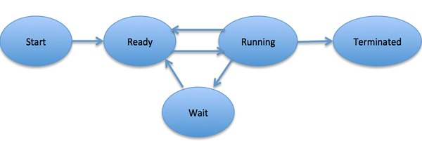
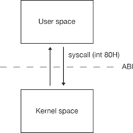

# Viva Question and Solutions

- [Viva Question and Solutions](#viva-question-and-solutions)
  - [Process](#process)
  - [Signal in OS](#signal-in-os)
  - [Deadlock](#deadlock)
  - [Threading](#threading)
  - [IPC (Inter Process Communication)](#ipc-inter-process-communication)
  - [Segmentation](#segmentation)
  - [System Call](#system-call)
  - [Mutual Exclusion](#mutual-exclusion)
  - [Get CPU Information](#get-cpu-information)
  - [Race Condition](#race-condition)
  - [Virtual Memory](#virtual-memory)
  - [Kernel](#kernel)
  - [Types of System Call](#types-of-system-call)
  - [Function or Task of OS](#function-or-task-of-os)

## Process

**What is a process**:

```text
* A process is basically a program in execution.
```

**How process stored in RAM/Memory**:


**Process Life Cycle**:

- Start
- Ready
- Running
- Waiting
- Terminate



**Process Control Block (PCB)**:

A Process Control Block is a data structure maintained by the Operating System for every process. The **PCB is identified by an integer process ID (PID)**. A PCB keeps all the information needed to keep track of a process

## Signal in OS

What is a signal?

- A signal is a message that is sent to a process to tell it to perform a specific task. Such as to terminate a process, to suspend a process, to resume a process, etc. The signal is sent to the process by the Operating System.

-  The kernel may pass an interrupt as a signal to the process that caused it (typical examples are SIGSEGV, SIGBUS, SIGILL and SIGFPE).

- An process can send signal itself vai kill().


## Deadlock

What is a deadlock? A

- Deadlock is a situation where two or more processes are waiting for each other to complete a task.
- To avoid a deadlock we use bankers algorithm.


## Threading

**What is a threading?**: A thread is a separate execution context in a process. A process can have multiple threads. A thread can be a process that is executing a single function.

**Advantages of Thread**:

- **Threads minimize the context switching time**.
- Use of threads provides concurrency within a process.
- Efficient communication.
- It is more **economical** to create and context switch threads.
- Threads allow **utilization of multiprocessor architectures** to a greater scale and efficiency.

**Types of Thread**:

Threads are implemented in following two ways −

- **User Level Threads** (User managed threads.)

**Advantages**:

- Thread switching does not require Kernel mode privileges.
- User level thread can run on any operating system.

**Disadvantages**:

- In a typical operating system, most system calls are blocking.
- Multithreaded application cannot take advantage of multiprocessing.

- **Kernel Level Threads** − (Operating System managed threads acting on kernel, an operating system core.)

## IPC (Inter Process Communication)

**What is IPC**: Inter process communication is the mechanism by which two processes can exchange data. It is also known as message passing.


**Approaches to Interprocess Communication**:

- **Pipe**: Pipe is a unidirectional communication channel. Two process bi-directional we need two pipes. Pipe are two types:

    - Named Pipe
    - Unnamed Pipe

- **Socket**: The socket is the endpoint for sending or receiving data in a network. It is bi-directional communication channel.

> Most of the operating systems use sockets for interprocess communication.

- **Signal**: Already talked about.
- **Shared Memory**: Shared memory is a memory segment that is shared between processes.

**Synchronization in Interprocess Communication**:

**Semaphore**:

- A semaphore is a variable that is used to control access to a shared resource.
- The two types of semaphores are
  - **binary semaphores** and
  - **counting semaphores**.

**Mutual Exclusion**

Mutual exclusion requires that only one process thread can enter the critical section at a time. This is useful for synchronization and also prevents race conditions.


## Segmentation

In Operating Systems, Segmentation is a memory management technique in which the memory is divided into the variable size parts. Each part is known as a segment which can be allocated to a process.

The details about each segment are stored in a table called a segment table.

Segment table contains mainly two information about segment:

- **Base**: It is the base address of the segment
- **Limit**: It is the length of the segment.

**Translation of Logical address into physical address by segment table**:

CPU generates a logical address which contains two parts:

- Segment Number
- Offset

**Advantages of Segmentation**:

- No internal fragmentation
- Average Segment Size is larger than the actual page size.
- Less overhead
- It is easier to relocate segments than entire address space.
- The segment table is of lesser size as compared to the page table in paging.

## System Call

In computing, a system call (commonly abbreviated to syscall) is the programmatic way in which a computer program requests a service from the kernel of the operating system on which it is executed.



## Mutual Exclusion


A mutual exclusion (mutex) is a program object that **prevents simultaneous access to a shared resource.**

## Get CPU Information

To get cpu information in linux. we need open /proc/cpuinfo file.

```c

int main() {
   FILE *cpuinfo = fopen("/proc/cpuinfo", "rb");
}
```

## Race Condition

A race condition occurs when two threads access a shared variable at the same time.

## Virtual Memory

A computer can address more memory than the amount physically installed on the system. This extra memory is actually called virtual memory and it is a section of a hard disk that's set up to emulate the computer's RAM.

## Kernel

```text
Kernel is the core part of an operating system which manages
system resources. It also acts like a bridge between
application and hardware of the computer
```

## Types of System Call

- Process Control (fork, exec, wait, exit, waitpid)
- File Management (open, close, read, write, lseek, fstat, fcntl)
- Device Management (ioctl, select, poll, mmap, munmap)
- Information maintenance (getpid, alarm, sleep, gettimeofday)
- Communication (pipe, socket, connect, accept, send, recv, sento,)
- Protection (chmod, chown, umask, getuid, getgid, setuid, setgid)

## Function or Task of OS

The main tasks of an OS are:
1. Process Management
2. Memory Management
3. Mass-Storage Management
4. Cache Management
5. File System Management
6. I/O System Management
7. Protection and Security


